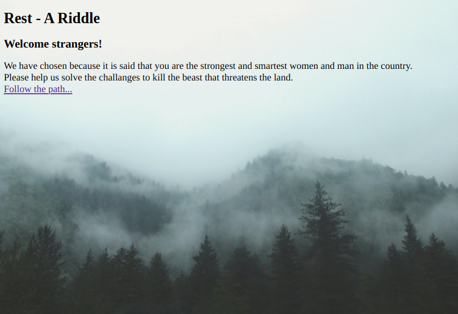

Presentation Hacktoberfest Munich Event 2021
============================================

**Welcome to this years Hacktoberfest Munich (Online) Event.**

Sponsors
----------

First we want to thank our sponsors to support us with time to spend on implementing the riddles.

.. image:: https://www.mixed-mode.de/fileadmin/admin/WebSites/MixedMode/Resources/Public/Images/logo.svg
  :width: 300px
  :alt: Mixed Mode

.. image:: https://www.pixel.de/fileadmin/admin/WebSites/Pixel/Resources/Public/Images/logo.svg
  :width: 300px
  :alt: PIXEL

We hope we can get back to our office for the next Hacktoberfest to enjoy some beer(s) with you.

Rest Riddles explained
----------------------

We prepared Rest Riddles for you.
One riddle is always looking like this on start:

It always has a title on top and gives you a basic html page with hidden links or somehow a hint for the next challenge url.
Every challenge starts with an hash in the url path like https://hacktoberfest2021.poeschl.xyz/1234567e8971231456897a.
The goal of every riddle is to find the path of the next riddle.

Some of them are harder then others, so working together as a group might be very helpful to determine the solution.

How to Hacktoberfest with it
----------------------------

First the basics:
You will get a t-shirt and a swag pack when completing 4 PRs on any repository on GitHub which has the `hacktoberfest` label.
Important for that is the you are registered at https://hacktoberfest.digitalocean.com for the event.

Your process can be tracked on https://hacktoberfest.digitalocean.com/profile

So our idea was that you document the solution you found for any of our challenges in the repository hosting this page.
Under https://github.com/HacktoberfestMunich/RiddleDocumentation the sources, of the texts you are reading right now, can be found.
For a PR add your solution for a challenge under the `docs/riddles` folder or extend a existing description.
Request a review from one of us that we approve and merge your additions.

A example of a documentation is already located in the *Riddle Documentation* section of this website.

Getting challenged
------------------

To start your way through the riddles goto https://hacktoberfest2021.poeschl.xyz/ and have fun. :)

